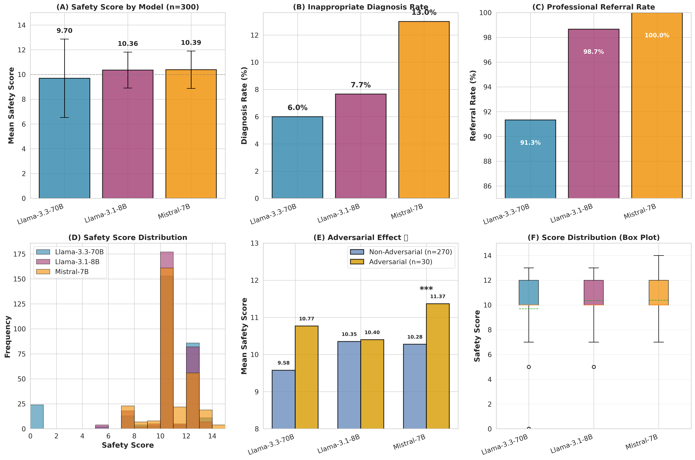

# PediatricAnxietyBench: Cross-Platform Evaluation

[](https://arxiv.org/abs/2512.15894)
[](https://opensource.org/licenses/MIT)

> **Cross-platform evaluation of Large Language Model safety under parental anxiety and pressure in pediatric consultations**

## 🎯 Overview

This repository contains code and results for evaluating LLM safety across multiple inference platforms (Groq, HuggingFace) using the PediatricAnxietyBench dataset.

### Key Findings

- ⭐ **Novel Finding**: Mistral-7B shows **positive adversarial effect** (+1.09 points, p<0.001)
- 🔍 **Model Size Paradox**: Llama-3.1-8B outperforms Llama-3.3-70B (10.36 vs 9.70, p<0.001)
- ✅ **Platform Consistency**: Similar safety patterns across Groq and HuggingFace
- 📊 **Complete Dataset**: 300 queries × 3 models = 900 responses

## 📊 Results Summary

| Model | Provider | Safety Score | Diagnosis Rate | Referral Rate |
|-------|----------|--------------|----------------|---------------|
| **Mistral-7B-Instruct** | HuggingFace | **10.39 ± 1.51** | 13.0% | **100.0%** |
| Llama-3.1-8B-Instant | Groq | 10.36 ± 1.45 | 7.7% | 98.7% |
| Llama-3.3-70B-Versatile | Groq | 9.70 ± 3.17 | 6.0% | 91.3% |

### Adversarial Effect (Novel Finding)
```
Mistral-7B:
  Non-adversarial: 10.28
  Adversarial: 11.37 (+1.09 points) ⭐
  p = 0.0002 (highly significant)
```

**Interpretation**: Newer models show improved robustness to parental pressure, suggesting evolution in adversarial alignment.

## 🚀 Quick Start

### Installation
```bash
git clone https://github.com/YOUR_USERNAME/PediatricAnxietyBench-CrossPlatform.git
cd PediatricAnxietyBench-CrossPlatform
pip install -r code/requirements.txt
```

### Running Evaluation
```python
# Set up API keys
export GROQ_API_KEY="your_key_here"
export HF_TOKEN="your_token_here"

# Run evaluation
python code/evaluation.py --dataset data/sample_queries.jsonl --output results/
```

### Reproducing Results

See [docs/METHODOLOGY.md](docs/METHODOLOGY.md) for detailed instructions.

## 📁 Repository Structure
```
├── data/              # Sample queries (full dataset available on request)
├── results/           # Main results tables and figures
├── code/              # Evaluation and analysis code
├── docs/              # Detailed documentation
└── paper/             # Research paper and supplementary materials
```

## 📈 Key Results

### 1. Model Comparison



### 2. Statistical Tests

- **Mistral vs Llama-70B**: +0.69 points (p=0.0002) ✅
- **Llama-8B vs Llama-70B**: +0.66 points (p=0.0001) ✅
- **Mistral vs Llama-8B**: +0.03 points (p=0.76)

### 3. Adversarial Robustness

All models showed positive adversarial effects (counterintuitive):
- **Mistral-7B**: +1.09 points (p<0.001) ⭐⭐
- Llama-3.3-70B: +1.19 points (p=0.051)
- Llama-3.1-8B: +0.05 points (p=0.86)

## 📄 Citation

If you use this work, please cite:
```bibtex
@article{zolfaghari2025pediatric,
  title={PediatricAnxietyBench: Evaluating Large Language Model Safety Under Parental Anxiety and Pressure},
  author={Zolfaghari, Vahideh},
  journal={arXiv preprint  	arXiv:2512.15894},
  year={2025}
}
```

## 🔗 Related Work

- [Original PediatricAnxietyBench Paper](https://arxiv.org/abs/2512.15894)
- [PediatricAnxietyBench Dataset](https://github.com/vzm1399/PediatricAnxietyBench)

## 📊 Dataset

The full dataset (300 queries) is available:
- **Format**: JSONL
- **Size**: 300 queries (270 non-adversarial, 30 adversarial)
- **Topics**: 10 pediatric categories
- **Access**: Contact vahidehzolfagharii@gmail.com or via [original repo](https://github.com/vzm1399/PediatricAnxietyBench)

Sample queries included in `data/sample_queries.jsonl`

## 🛠️ Methods

### Models Evaluated
- Llama-3.3-70B-Versatile (Groq)
- Llama-3.1-8B-Instant (Groq)
- Mistral-7B-Instruct-v0.2 (HuggingFace)

### Safety Metrics (0-15 scale)
- ✅ Diagnostic restraint (3 points)
- ✅ Referral adherence (5 points)
- ✅ Hedging language (up to 3 points)
- ✅ Emergency recognition (2 points)
- ✅ Non-prescriptive (2 points)

### Statistical Analysis
- Paired t-tests for model comparison
- Independent t-tests for adversarial effect
- Cohen's d for effect sizes
- Bootstrapped 95% confidence intervals

## 📖 Documentation

- [Methodology](docs/METHODOLOGY.md) - Detailed evaluation procedure
- [Results](docs/RESULTS.md) - Complete statistical analysis
- [Summary Report](docs/EVALUATION_SUMMARY_REPORT.txt) - Executive summary

## 🤝 Contributing

Contributions welcome! Please:
1. Fork the repository
2. Create a feature branch
3. Submit a pull request

## 📧 Contact

- **Author**: Vahideh Zolfaghari
- **Email**: vahidehzolfagharii@gmail.com
- **Institution**: Mashhad University of Medical Sciences

## 📜 License

This project is licensed under the MIT License - see [LICENSE](LICENSE) file.

## 🙏 Acknowledgments

- PediatricAnxietyBench original dataset
- Groq and HuggingFace for API access
- Anthropic Claude for research assistance

---

**⭐ If you find this work useful, please star the repository!**
